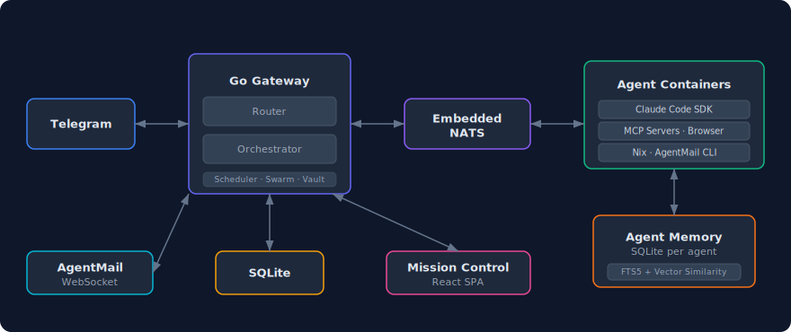

<p align="center">
  
</p>

# Praktor

Personal AI agent assistant. A single Go binary that receives messages from Telegram, routes them to named agents running Claude Code in isolated Docker containers, and serves a real-time Mission Control web UI. Self-hosted, single-binary deployment via Docker Compose.

<p align="center">
  
</p>

## Features

- **Mission Control** — Real-time dashboard with WebSocket updates
- **Telegram I/O** — Chat with your agents from your phone
- **Telegram commands** — `/start`, `/stop`, `/reset`, `/nix`, `/agents`, `/commands`
- **Named agents** — Multiple agents with distinct roles, models, and configurations
- **Smart routing** — `@agent_name` prefix or AI-powered routing via the default agent
- **Per-agent isolation** — Each agent runs in its own Docker container with its own filesystem
- **Persistent memory** — Per-agent SQLite memory database with hybrid search (FTS5 keyword + vector semantic similarity via all-MiniLM-L6-v2) for storing and recalling facts across sessions
- **Agent identity** — Each agent has an `AGENT.md` for personality and expertise, editable from Mission Control or by agents themselves
- **User profile** — Agents know who you are via `USER.md`, editable from Mission Control or by agents themselves
- **Scheduled tasks** — Cron, interval, or one-shot jobs that run agents and deliver results via Telegram. Multiple tasks execute in parallel (up to 3 concurrent) with independent sessions
- **Secure vault** — AES-256-GCM encrypted secrets injected as env vars or files at container start, never exposed to the LLM
- **Web & browser access** — Agents can search the web and automate browsers via [agent-browser](https://github.com/vercel-labs/agent-browser)
- **Email via AgentMail** — Agents can send and receive email via [AgentMail](https://agentmail.to/). Configure an inbox per agent and the gateway handles real-time email routing
- **Hot config reload** — Edit `praktor.yaml` and changes apply automatically, no restart needed
- **Nix package manager** — Agents can install packages on demand (Python, ffmpeg, LaTeX, etc.) via MCP tools or the `/nix` Telegram command
- **Agent extensions** — Per-agent MCP servers, plugins, and skills, managed via Mission Control
- **Agent swarms** — Graph-based multi-agent orchestration with fan-out, pipeline, and collaborative patterns
- **Backup & restore** — Back up and restore all Docker volumes as zstd-compressed tarballs via CLI

## Prerequisites

- Docker and Docker Compose
- A Telegram bot token ([create one with @BotFather](https://t.me/BotFather))
- A Claude authentication method: [Anthropic API key](https://console.anthropic.com/) or Claude Code OAuth token (`claude setup-token`)

> **Note on OAuth tokens:** Using Claude Code OAuth tokens with third-party applications must comply with Anthropic's [authentication and credential use policy](https://code.claude.com/docs/en/legal-and-compliance#authentication-and-credential-use). Review the policy before using this method. OAuth token support is deprecated and will be removed in a future version.

## Getting Started

### 1. Clone and Configure

```sh
git clone https://github.com/mtzanidakis/praktor.git
cd praktor
cp config/praktor.example.yaml config/praktor.yaml
cp .env.example .env && chmod 0600 .env
```

Edit `.env` and fill in your credentials (see comments in the file for details). Set `DOCKER_GID` to the group ID of the `docker` group on your host so the non-root container user can access the Docker socket:

```sh
grep docker /etc/group    # look for the docker group GID
```

Edit `config/praktor.yaml` to define your agents:

```yaml
telegram:
  allow_from: []            # Telegram user IDs (empty = allow all)
  main_chat_id: 0           # Chat ID for scheduled task / swarm results

defaults:
  model: "claude-sonnet-4-6"
  max_running: 5
  idle_timeout: 10m

agents:
  general:
    description: "General-purpose assistant for everyday tasks"
    nix_enabled: true
  coder:
    description: "Software engineering specialist"
    model: "claude-opus-4-6"
    nix_enabled: true
    env:
      GITHUB_TOKEN: "secret:github-token"    # Resolved from vault
  researcher:
    description: "Web research and analysis"
    allowed_tools: [WebSearch, WebFetch, Read, Write]

router:
  default_agent: general
```

### 2. Build and Run

```sh
docker compose build agent    # Build the agent image locally
docker compose up -d          # Start the stack (pulls gateway from GHCR)
docker compose logs -f        # Watch logs
```

The agent image must be built locally because it bundles proprietary third-party software that cannot be redistributed. See [Third-Party Notice](#third-party-notice) for details.

Mission Control is available at `http://localhost:8080`.

### 3. Start Chatting

Open Telegram and send a message to your bot. Praktor routes it to the right agent, spins up a container, and responds. Use `@agent_name` to target a specific agent:

```
Hello!                              → routed to default agent
@coder fix the login bug            → routed to coder
@researcher find papers on RAG      → routed to researcher
```

For a secure setup without exposed ports, see [Production Deployment](https://github.com/mtzanidakis/praktor/wiki/Production-Deployment).

## Upgrading

Pull the latest code, images, and rebuild the agent:

```sh
./scripts/upgrade.sh
```

Then restart the stack:

```sh
docker compose up -d
```

## Documentation

See the **[Wiki](https://github.com/mtzanidakis/praktor/wiki)** for detailed documentation on all features:

[Hot Config Reload](https://github.com/mtzanidakis/praktor/wiki/Hot-Config-Reload) · [Vault](https://github.com/mtzanidakis/praktor/wiki/Vault) · [Browser Automation](https://github.com/mtzanidakis/praktor/wiki/Browser-Automation) · [AgentMail](https://github.com/mtzanidakis/praktor/wiki/AgentMail) · [Agent Extensions](https://github.com/mtzanidakis/praktor/wiki/Agent-Extensions) · [Agent Swarms](https://github.com/mtzanidakis/praktor/wiki/Agent-Swarms) · [Nix Package Manager](https://github.com/mtzanidakis/praktor/wiki/Nix-Package-Manager) · [Backup & Restore](https://github.com/mtzanidakis/praktor/wiki/Backup-and-Restore) · [Production Deployment](https://github.com/mtzanidakis/praktor/wiki/Production-Deployment)

## Getting Help

After cloning the repo, you can use [Claude Code](https://docs.anthropic.com/en/docs/claude-code) to get help with any aspect of Praktor. The project includes a detailed `CLAUDE.md` that gives Claude full context about the architecture, configuration, and available APIs.

```sh
git clone https://github.com/mtzanidakis/praktor.git
cd praktor
claude
```

For example, you can ask Claude Code things like:

- "How do I install an MCP server on a Praktor agent?"
- "How do I add a new agent to my configuration?"
- "How do I set up secrets for an agent?"

## Development

```sh
go mod download              # Install Go dependencies
make dev                     # Run the gateway locally
make test                    # Run tests
```

Mission Control with hot reload:

```sh
cd ui && npm install && npm run dev    # Vite dev server on :5173, proxies /api to :8080
```

## License

See [LICENSE](LICENSE).

## Third-Party Notice

This project integrates with third-party tools that have their own licenses and terms of service. In particular, [Claude Code](https://github.com/anthropics/claude-code) and the [Claude Agent SDK](https://github.com/anthropics/claude-agent-sdk-typescript) are proprietary software by Anthropic and subject to [Anthropic's Commercial Terms of Service](https://www.anthropic.com/legal/commercial-terms). They are not included in this repository — users must install them at build time and are responsible for complying with Anthropic's terms. Pre-built Docker images containing these components should not be redistributed without Anthropic's permission.
